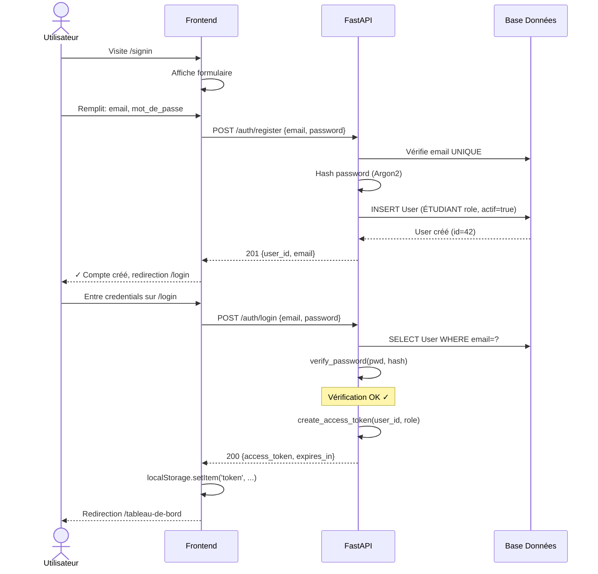
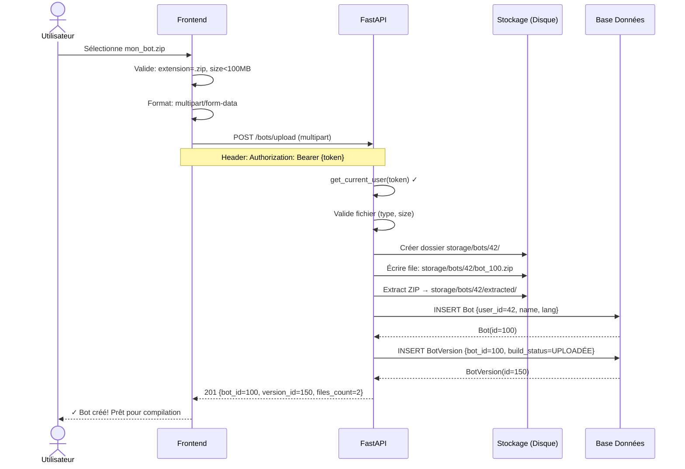
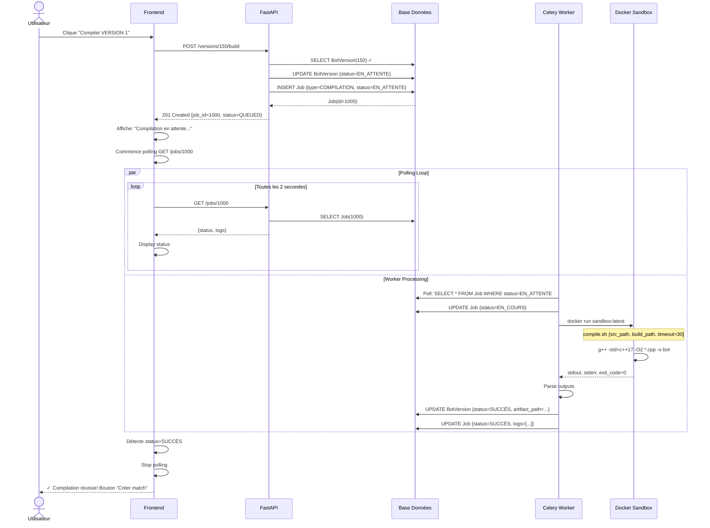
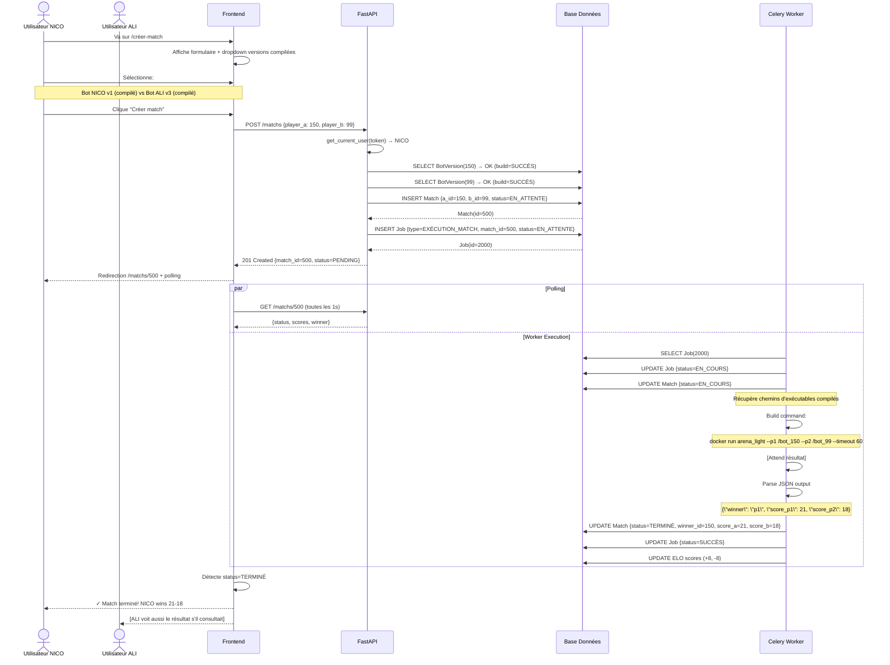
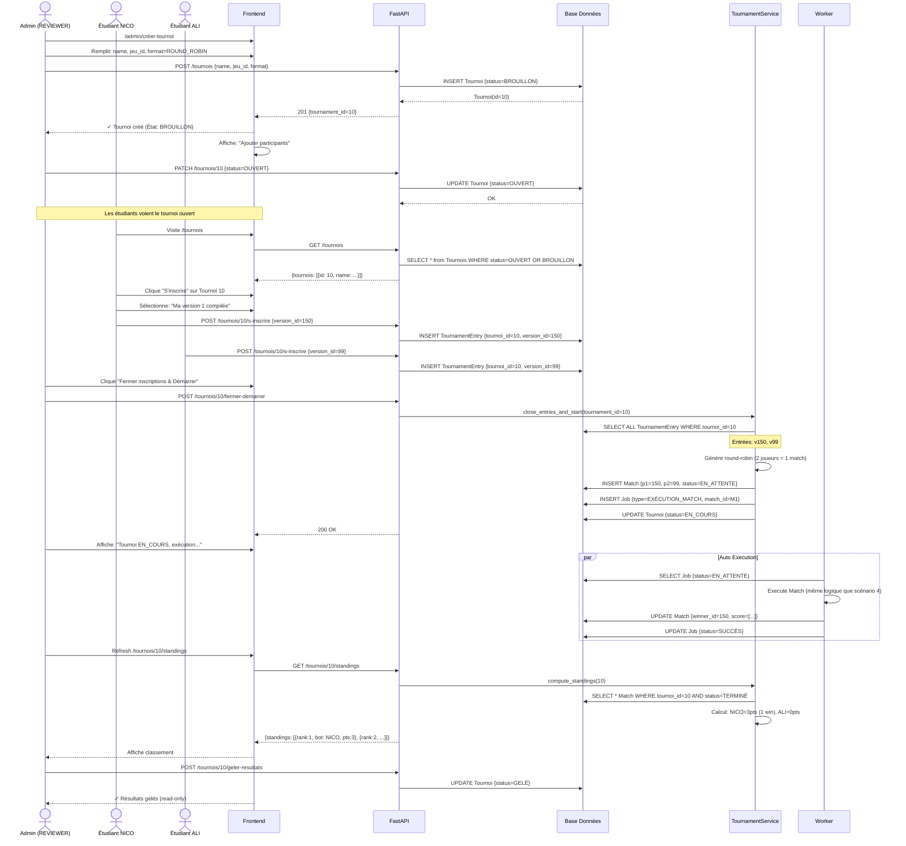
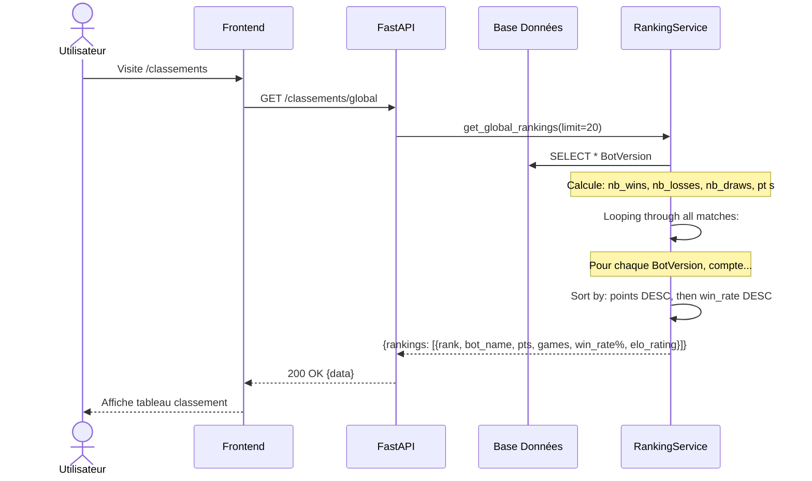
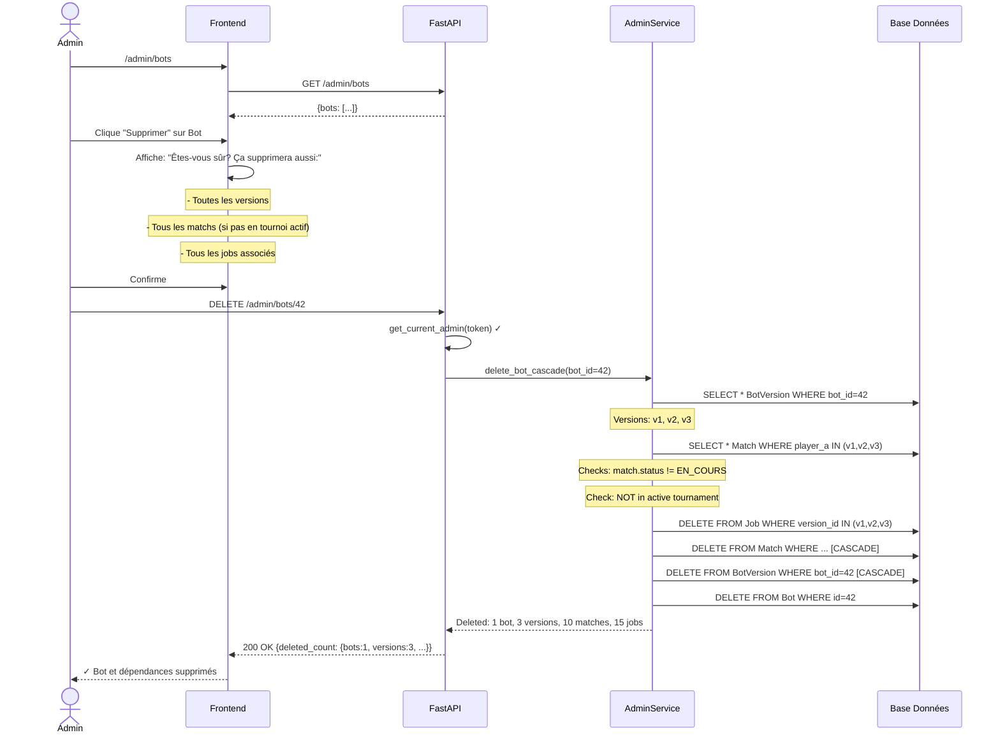
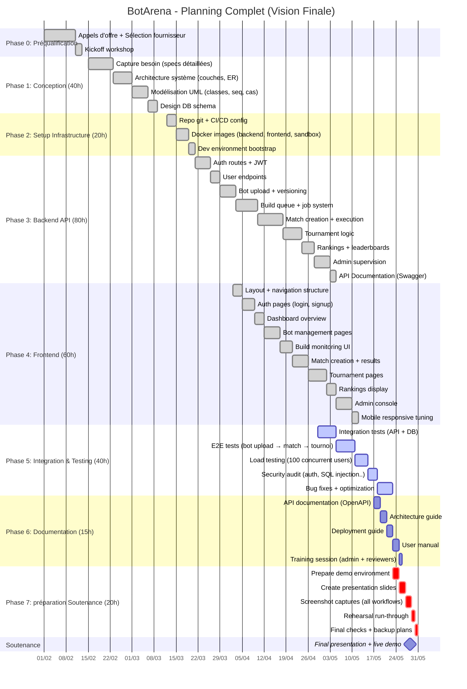

## 1) DIAGRAMME DE CLASSES COMPLET

```
┌─────────────────────────────────────────────────────────────────────────────┐
│                   DIAGRAMME DE CLASSES - UML (ASCII)                         │
│                        BOTARENA COMPLET                                      │
└─────────────────────────────────────────────────────────────────────────────┘

┌────────────────────────────────────────────────────────────────────────────┐
│                  COUCHE AUTHENTIFICATION & UTILISATEURS                    │
└────────────────────────────────────────────────────────────────────────────┘

┏━━━━━━━━━━━━━━━━━━━━━━━━━━━━━━━━━┓
┃         UTILISATEUR (User)      ┃
┣━━━━━━━━━━━━━━━━━━━━━━━━━━━━━━━━━┫
┃ id : INT (PK)                  ┃
┃ nom_utilisateur : STR (UNIQUE) ┃
┃ email : STR (UNIQUE)           ┃
┃ hash_mot_passe : STR           ┃
┃ rôle : ENUM                    ┃
┃   → ETUDIANT (par défaut)      ┃
┃   → REVIEWER                   ┃
┃   → ADMIN                      ┃
┃ actif : BOOL (défaut: true)    ┃
┃ créé_à : DATETIME              ┃
┃ modifié_à : DATETIME           ┃
┗━━━━━━━━━━━━━━━━━━━━━━━━━━━━━━━━━┛
         │
         │ possède (1:N)
         ▼
┏━━━━━━━━━━━━━━━━━━━━━━━━━━━━━━━━━┓
┃           BOT                   ┃
┣━━━━━━━━━━━━━━━━━━━━━━━━━━━━━━━━━┫
┃ id : INT (PK)                  ┃
┃ utilisateur_id : INT (FK)      ┃
┃ nom : STR                      ┃
┃ description : STR              ┃
┃ langage : STR (C++, Python..)  ┃
┃ actif : BOOL                   ┃
┃ créé_à : DATETIME              ┃
┗━━━━━━━━━━━━━━━━━━━━━━━━━━━━━━━━━┛
         │
         │ contient (1:N)
         ▼
┏━━━━━━━━━━━━━━━━━━━━━━━━━━━━━━━━━┓
┃       VERSION BOT               ┃
┃      (BotVersion)              ┃
┣━━━━━━━━━━━━━━━━━━━━━━━━━━━━━━━━━┫
┃ id : INT (PK)                  ┃
┃ bot_id : INT (FK)              ┃
┃ jeu_id : INT (FK)              ┃
┃ numéro_version : INT           ┃
┃ statut_build : ENUM            ┃
┃   → UPLOADÉE                   ┃
┃   → EN_ATTENTE                 ┃
┃   → EN_COMPILATION             ┃
┃   → SUCCÈS                     ┃
┃   → ÉCHEC                      ┃
┃ chemin_artefact : STR          ┃
┃ classement_elo : FLOAT         ┃
┃ jeux_elo : INT                 ┃
┃ créé_à : DATETIME              ┃
┗━━━━━━━━━━━━━━━━━━━━━━━━━━━━━━━━━┛


┌────────────────────────────────────────────────────────────────────────────┐
│                    COUCHE JEU & MATCHS                                     │
└────────────────────────────────────────────────────────────────────────────┘

┏━━━━━━━━━━━━━━━━━━━━━━━━━━━━━━━━━┓
┃            JEU (Game)           ┃
┣━━━━━━━━━━━━━━━━━━━━━━━━━━━━━━━━━┫
┃ id : INT (PK)                  ┃
┃ nom : STR ("Connect-4", ...)   ┃
┃ description : STR              ┃
┃ joueurs_min : INT              ┃
┃ joueurs_max : INT              ┃
┃ actif : BOOL                   ┃
┗━━━━━━━━━━━━━━━━━━━━━━━━━━━━━━━━━┛
         △  (1:N)
         │
         │ utilise
         │
         ┌──────────────────────────────┐
         │                              │
    ┌────┴────────┐          ┌─────────┴────┐
    │ BotVersion  │          │ Match        │
    └─────────────┘          └──────────────┘


┏━━━━━━━━━━━━━━━━━━━━━━━━━━━━━━━━━┓
┃            MATCH                 ┃
┣━━━━━━━━━━━━━━━━━━━━━━━━━━━━━━━━━┫
┃ id : INT (PK)                  ┃
┃ version_bot_a_id : INT (FK)    ┃
┃ version_bot_b_id : INT (FK)    ┃
┃ jeu_id : INT (FK)              ┃
┃ tournoi_id : INT (FK, NULL)    ┃
┃ statut : ENUM                  ┃
┃   → EN_ATTENTE                 ┃
┃   → EN_COURS                   ┃
┃   → TERMINÉ                    ┃
┃   → ÉCHEC                      ┃
┃ version_gagnante_id : INT      ┃
┃ score_a : INT                  ┃
┃ score_b : INT                  ┃
┃ est_égalité : BOOL             ┃
┃ logs : STR (texte long)        ┃
┃ créé_à : DATETIME              ┃
┃ exécuté_à : DATETIME           ┃
┗━━━━━━━━━━━━━━━━━━━━━━━━━━━━━━━━━┛


┌────────────────────────────────────────────────────────────────────────────┐
│                      COUCHE TOURNOI                                        │
└────────────────────────────────────────────────────────────────────────────┘

┏━━━━━━━━━━━━━━━━━━━━━━━━━━━━━━━━━┓
┃          TOURNOI                ┃
┃       (Tournament)              ┃
┣━━━━━━━━━━━━━━━━━━━━━━━━━━━━━━━━━┫
┃ id : INT (PK)                  ┃
┃ nom : STR                      ┃
┃ description : STR              ┃
┃ jeu_id : INT (FK)              ┃
┃ statut : ENUM                  ┃
┃   → BROUILLON                  ┃
┃   → OUVERT (inscriptions)      ┃
┃   → FERMÉ                      ┃
┃   → EN_COURS                   ┃
┃   → TERMINÉ                    ┃
┃   → GELÉ                       ┃
┃ format : STR ("ROUND_ROBIN")   ┃
┃ inscriptions_ouvertes : DATE   ┃
┃ inscriptions_fermées : DATE    ┃
┃ démarré_à : DATETIME           ┃
┃ terminé_à : DATETIME           ┃
┃ gelé_à : DATETIME              ┃
┃ résultats_gelés : JSON         ┃
┃ créé_par : INT (FK User)       ┃
┗━━━━━━━━━━━━━━━━━━━━━━━━━━━━━━━━━┛
         │
         │ enregistre (1:N)
         ▼
┏━━━━━━━━━━━━━━━━━━━━━━━━━━━━━━━━━┓
┃    PARTICIPATION TOURNOI         ┃
┃  (TournamentEntry)              ┃
┣━━━━━━━━━━━━━━━━━━━━━━━━━━━━━━━━━┫
┃ id : INT (PK)                  ┃
┃ tournoi_id : INT (FK)          ┃
┃ version_bot_id : INT (FK)      ┃
┃ créé_à : DATETIME              ┃
┗━━━━━━━━━━━━━━━━━━━━━━━━━━━━━━━━━┛


┌────────────────────────────────────────────────────────────────────────────┐
│                    COUCHE TRAVAUX ASYNCHRONES                              │
└────────────────────────────────────────────────────────────────────────────┘

┏━━━━━━━━━━━━━━━━━━━━━━━━━━━━━━━━━┓
┃            TRAVAIL               ┃
┃             (Job)               ┃
┣━━━━━━━━━━━━━━━━━━━━━━━━━━━━━━━━━┫
┃ id : INT (PK)                  ┃
┃ type_travail : ENUM            ┃
┃   → COMPILATION                ┃
┃   → EXÉCUTION_MATCH            ┃
┃ statut : ENUM                  ┃
┃   → EN_ATTENTE                 ┃
┃   → EN_COURS                   ┃
┃   → SUCCÈS                     ┃
┃   → ERREUR                     ┃
┃   → DÉPASSEMENT_TEMPS          ┃
┃ version_bot_id : INT (FK, NULL)┃
┃ match_id : INT (FK, NULL)      ┃
┃ messages_erreur : STR          ┃
┃ logs : STR (texte long)        ┃
┃ démarré_à : DATETIME           ┃
┃ terminé_à : DATETIME           ┃
┗━━━━━━━━━━━━━━━━━━━━━━━━━━━━━━━━━┛
```

---

## 2) DIAGRAMME DE CAS D'UTILISATION (Détail complet)

```
┌─────────────────────────────────────────────────────────────────────────────┐
│               DIAGRAMME DE CAS D'UTILISATION - UML                          │
│                     BOTARENA - TOUS LES RÔLES                               │
└─────────────────────────────────────────────────────────────────────────────┘

System: Plateforme BotArena

ACTEURS:
─────────

┌─────────────────┐
│    ÉTUDIANT     │  Rôle par défaut
│  (Participant)  │  ✓ Inscrit
│                 │  ✓ Peut jouer
└─────────────────┘
         │
         ├──► S'authentifier (email + mdp)
         ├──► Consulter profil personnel
         │
         ├──► CAS UTILISATEUR: Gestion Bot
         │    ├──► Créer un bot
         │    ├──► Uploader source (ZIP)
         │    ├──► Voir versions précédentes
         │    └──► Supprimer bot
         │
         ├──► CAS UTILISATEUR: Compilation
         │    ├──► Lancer compilation (1 version)
         │    ├──► Consulter logs de compilation
         │    ├──► Voir statut de building en temps réel
         │    └──► Télécharger artefact si succès
         │
         ├──► CAS UTILISATEUR: Matchs
         │    ├──► Créer match manuel (2 versions)
         │    ├──► Suivre résultat du match
         │    ├──► Voir historique matchs
         │    ├──► Consulter logs match
         │    └──► Analyser score & vainqueur
         │
         ├──► CAS UTILISATEUR: Tournois
         │    ├──► Consulter tournois disponibles
         │    ├──► Demander inscription à tournoi
         │    ├──► Voir statut inscription (en attente / accepté / rejeté)
         │    ├──► Consulter classement tournoi
         │    ├──► Voir matchs du tournoi
         │    └──► Retirer sa version d'un tournoi (si pas commencé)
         │
         └──► CAS UTILISATEUR: Classements
              ├──► Voir classement global (tous jeux)
              ├──► Voir classement par jeu
              ├──► Voir historique ELO
              └──► Comparer statistiques vs autre bot


┌──────────────────┐
│    REVIEWER      │  Superviseur
│  (Superviseur)   │  ✓ Tous les droits étudiant
│                 │  ✓ Peut créer tournois
│                 │  ✓ Supervision
└──────────────────┘
         │
         ├──► [Tous les CAS ÉTUDIANT]
         │
         ├──► CAS UTILISATEUR: Admin Tournoi
         │    ├──► Créer nouveau tournoi
         │    ├──► Modifier détails tournoi (avant démarrage)
         │    ├──► Ajouter versions manuellement
         │    ├──► Accepter/Rejeter inscriptions
         │    ├──► Fermer inscriptions → Générer matchs
         │    ├──► Délancer tournoi → Montrer standings
         │    ├──► Geler résultats
         │    └──► Supprimer tournoi (si brouillon)
         │
         └──► CAS UTILISATEUR: Supervision
              ├──► Voir tous les jobs en cours
              ├──► Voir logs détaillés (builds, matchs)
              ├──► Voir statistiques système
              └──► Exporter rapports


┌──────────────────┐
│      ADMIN       │  Administrateur
│ (Administrateur) │  ✓ Tous les droits
│                 │  ✓ Gestion complète
│                 │  ✓ Nettoyage données
└──────────────────┘
         │
         ├──► [Tous les CAS REVIEWER]
         │
         ├──► CAS UTILISATEUR: Gestion Utilisateurs
         │    ├──► Lister tous les utilisateurs
         │    ├──► Changer rôle (ÉTUDIANT ↔ REVIEWER ↔ ADMIN)
         │    ├──► Désactiver/Activer compte
         │    ├──► Supprimer utilisateur (avec cascade)
         │    └──► Voir audit log des actions
         │
         ├──► CAS UTILISATEUR: Gestion Bots (Admin)
         │    ├──► Lister tous les bots
         │    ├──► Forcer supprimer bot (cascade)
         │    ├──► Voir métadonnées complètes
         │    └──► Analyser stockage utilisé
         │
         ├──► CAS UTILISATEUR: Gestion Matchs (Admin)
         │    ├──► Voir tous les matchs
         │    ├──► Supprimer match (si pas en tournoi actif)
         │    ├──► Relancer match (bug)
         │    └──► Invalider résultat
         │
         ├──► CAS UTILISATEUR: Gestion Tournois (Admin)
         │    ├──► Voir tous les tournois (tous statuts)
         │    ├──► Forcer démarrage/arrêt
         │    ├──► Supprimer tournoi (avec cascade)
         │    └──► Modifier standings gelés
         │
         ├──► CAS UTILISATEUR: Système
         │    ├──► Voir santé système (DB, Redis, stockage)
         │    ├──► Redémarrer workers
         │    ├──► Effacer cache
         │    ├──► Forcer nettoyage fichiers obsolètes
         │    ├──► Exporter/Importer données
         │    └──► Voir logs erreurs critiques
         │
         └──► CAS UTILISATEUR: Audit
              ├──► Voir trace complète (qui a fait quoi, quand)
              ├──► Exporter audit (CSV)
              └──► Alertes anomalies


PRÉCÉDENCE & DÉPENDANCES:
─────────────────────────
S'authentifier → Tous les autres
Créer bot → Uploader source
Uploader source → Lancer compilation
Uploader source → Lancer match
Créer match → Suivre résultat
Créer tournoi (REVIEWER) → Accepter inscriptions
Fermer inscriptions → Générer matchs → Matchs s'exécutent auto
```

---

## 3) ARCHITECTURE EN COUCHES COMPLÈTE

```
┌──────────────────────────────────────────────────────────────────────────────┐
│                    ARCHITECTURE EN COUCHES - VUE COMPLÈTE                    │
│                            BOTARENA V1 MVP                                   │
└──────────────────────────────────────────────────────────────────────────────┘


╔════════════════════════════════════════════════════════════════════════════╗
║                         COUCHE PRÉSENTATION                               ║
║                    (Frontend React + TypeScript)                          ║
║                                                                            ║
║  localhost:5173 (Développement) ou :80 (Production via Nginx)            ║
║                                                                            ║
║  Pages:                                                                   ║
║  ├─ Connexion / Inscription                                              ║
║  ├─ Tableau de bord                                                      ║
║  ├─ Gestion bots (upload, versioning)                                   ║
║  ├─ Compilation (monitoring statut)                                      ║
║  ├─ Matchs (création, suivi, historique)                                ║
║  ├─ Tournois (inscription, standings)                                   ║
║  ├─ Classements globaux                                                 ║
║  └─ Panel admin (users, bots, jobs, nettoyage)                          ║
║                                                                            ║
║  État: React hooks + Axios API client                                    ║
║  Token: JWT stocké dans localStorage                                     ║
╚════════════════════════════════════════════════════════════════════════════╝
                            ↕ HTTP REST + Websocket
                         (JSON + Bearer token)

╔════════════════════════════════════════════════════════════════════════════╗
║                  COUCHE API (FastAPI) @ localhost:8000                     ║
║                                                                            ║
║  Routeurs:                                                                ║
║  ├─ /auth            → Login, Register, Refresh token                    ║
║  ├─ /utilisateurs    → Get me, List (admin)                             ║
║  ├─ /bots            → Upload, List, Get, Delete, My bots              ║
║  ├─ /versions        → Build trigger, Get build-log                    ║
║  ├─ /matchs          → Create, List, Get, Delete                       ║
║  ├─ /tournois        → Create, List, Register, Get standings           ║
║  ├─ /classements     → Global, Per-game, Per-user                      ║
║  ├─ /travaux         → Get job status, logs                            ║
║  └─ /admin           → Supervision, Users list, Delete cascade         ║
║                                                                            ║
║  Middleware:                                                              ║
║  ├─ JWT Verify (every request)                                          ║
║  ├─ Role Check (@admin, @reviewer)                                      ║
║  ├─ CORS Handler                                                        ║
║  └─ Error Handler (uniform error responses)                             ║
║                                                                            ║
║  Dépendances:                                                            ║
║  ├─ get_current_user()  → Decode JWT, return User                      ║
║  ├─ get_db()            → SQLAlchemy session                            ║
║  └─ Pydantic schemas    → Request/response validation                  ║
╚════════════════════════════════════════════════════════════════════════════╝
                            ↕ (Imports + Calls)

╔════════════════════════════════════════════════════════════════════════════╗
║            COUCHE SÉCURITÉ & VALIDATION                                    ║
║                                                                            ║
║  Sécurité (security.py):                                                  ║
║  ├─ create_access_token(user) → JWT signé (HS256, exp 8h)               ║
║  ├─ verify_token(token) → Decode + check expiration                     ║
║  ├─ get_current_user(token) → Load User from DB                         ║
║  ├─ hash_password(pwd) → Argon2 (backend library)                       ║
║  └─ verify_password(pwd, hash) → Compare                                ║
║                                                                            ║
║  Contrôle d'Accès (access_control.py):                                   ║
║  ├─ ensure_owns_bot(bot_id, user) → Check ownership OR is_admin        ║
║  ├─ ensure_owns_version(version_id, user)                               ║
║  ├─ ensure_owns_match(match_id, user)                                   ║
║  ├─ ensure_admin(user) → Raise if not admin                            ║
║  └─ ensure_reviewer(user) → Raise if not reviewer+ (with admin)        ║
║                                                                            ║
║  Validation (schemas/):                                                   ║
║  ├─ BotUploadSchema → name:str, description:str (optional)              ║
║  ├─ MatchCreateSchema → bot_a_id:int, bot_b_id:int                     ║
║  ├─ TournamentCreateSchema → name:str, jeu_id:int, format:str          ║
║  └─ [+ 15 autres schemas pour route]                                   ║
╚════════════════════════════════════════════════════════════════════════════╝
                            ↕ (Imports + Calls)

╔════════════════════════════════════════════════════════════════════════════╗
║            COUCHE SERVICES (Logique Métier)                                ║
║                                                                            ║
║  Services Principaux:                                                     ║
║                                                                            ║
║  bot_service.py:                                                          ║
║  └─ upload_bot(file, user)                                              ║
║     → Extract ZIP → Create DB records → Return bot_id                   ║
║                                                                            ║
║  build_service.py:                                                        ║
║  └─ queue_build(version_id) → Create Job(QUEUED)                        ║
║  └─ process_build_job(job) → Docker run, capture logs, store artifacts  ║
║  └─ get_build_log(version_id) → Read from storage                       ║
║                                                                            ║
║  match_service.py:                                                        ║
║  └─ create_match(bot_a_id, bot_b_id, tournament_id)                    ║
║     → Validate versions exist & built → Create Job(QUEUED)              ║
║  └─ execute_match_job(job) → Docker run arena, parse result             ║
║  └─ update_rankings(match) → Recompute ELO if needed                    ║
║                                                                            ║
║  tournament_service.py:                                                   ║
║  └─ create_tournament(name, jeu_id, format)                             ║
║  └─ add_entry(tournament_id, version_id)                                ║
║  └─ close_entries(tournament_id) → Generate round-robin matchs          ║
║  └─ compute_standings(tournament_id) → Aggregate wins/losses/draws      ║
║                                                                            ║
║  ranking_service.py:                                                      ║
║  └─ get_global_rankings()                                               ║
║  └─ get_game_rankings(game_id)                                          ║
║  └─ update_elo(winner_version, loser_version)                           ║
╚════════════════════════════════════════════════════════════════════════════╝
                            ↕ (ORM Queries)

╔════════════════════════════════════════════════════════════════════════════╗
║              COUCHE ORM (SQLAlchemy Models)                                ║
║                                                                            ║
║  Entités Principales:                                                     ║
║  ├─ User ◄─► Bot ◄─► BotVersion ◄─► Match ◄─► Tournament              ║
║  ├─ Job (QUEUED → RUNNING → SUCCESS/ERROR)                             ║
║  ├─ TournamentEntry (N:N entre Tournament et BotVersion)                 ║
║  └─ [+ Helpers, relationships, cascading deletes]                       ║
║                                                                            ║
║  Fonctionnalités:                                                        ║
║  ├─ Query builders (filter, order_by, limit)                            ║
║  ├─ Relationship loading (lazy, eager)                                  ║
║  ├─ Cascade delete (orphan cleanup)                                     ║
║  ├─ Auto-timestamps (created_at, updated_at)                            ║
║  └─ Soft deletes (is_active flag)                                       ║
╚════════════════════════════════════════════════════════════════════════════╝
                            ↕ (SQL Queries)

╔════════════════════════════════════════════════════════════════════════════╗
║                  COUCHE BASE DE DONNÉES                                    ║
║                                                                            ║
║  SQLite (Development) → botarena.db                                       ║
║  PostgreSQL (Production, to implement)                                    ║
║                                                                            ║
║  Schéma:                                                                  ║
║  ├─ users                                                                ║
║  ├─ bots                                                                 ║
║  ├─ bot_versions                                                        ║
║  ├─ jeux (games)                                                        ║
║  ├─ matchs                                                              ║
║  ├─ tournois                                                            ║
║  ├─ tournament_entries                                                  ║
║  ├─ travaux (jobs)                                                      ║
║  └─ [+ indexes sur FK, created_at]                                     ║
║                                                                            ║
║  Contraintes:                                                            ║
║  ├─ PK: id pour chaque table                                           ║
║  ├─ FK: Cascading deletes                                              ║
║  ├─ Unique: (username, email)                                          ║
║  └─ Indexes: (user_id, version_id, match_id, job_type)                 ║
╚════════════════════════════════════════════════════════════════════════════╝


FLUX DE DONNÉES (Exemple: Créer Match):
────────────────────────────────────────

  Frontend                    Backend                  Worker
    │                          │                         │
    ├─► POST /matchs ─────────►│                         │
    │                          │ 1. Validate versions    │
    │                          │ 2. Create Match(PENDING)│
    │                          │ 3. Create Job(QUEUED)   │
    │◄─ 201 {match_id, job_id}─┤                         │
    │                          │                         │
    │ Poll GET /jobs/{job_id}─►│ Poll DB                 │
    │                          │ 4. Find Job(QUEUED)     │
    │                          │ 5. Set to RUNNING       │
    │                          ├─ Docker run arena ────►│
    │                          │                    Execute
    │◄─ {status: RUNNING} ─────┤                         │
    │                          │ 6. Parse output         │
    │ Poll again...            │ 7. Update Match(FINISHED)
    │                          │ 8. Set Job(SUCCESS)     │
    │◄─ {status: SUCCESS} ─────┤                         │
    │                          │                         │
    ├─ GET /matchs/{id} ──────►│                         │
    │◄─ {winner, scores, logs}─┤                         │
```

---

## 4) WORKFLOW COMPLET (Upload → Build → Match → Tournoi)

```
┌──────────────────────────────────────────────────────────────────────────────┐
│              FLUX DE TRAVAIL COMPLET - TOUS LES SCÉNARIOS                    │
└──────────────────────────────────────────────────────────────────────────────┘

SCÉNARIO A: Création de compte & Upload (Nouvel étudiant)
───────────────────────────────────────────────────────

Jour 1 - Inscription
    ╔════════════════╗
    ║ ÉTUDIANT NICO  ║
    ╚════════════════╝
            │
    1.      ├─► https://botarena.local
            ├─► Lien "S'inscrire"
            ├─► Formulaire: email + mot_passe
            ├─ POST /auth/register
            │
            ▼        Database: Create User (ÉTUDIANT)
         ┌─────────────────────────────────────┐
         │ User(id=42)                         │
         │ email: nico@univ.edu                │
         │ rôle: ÉTUDIANT                      │
         │ créé: 2026-05-13 10:00:00          │
         └─────────────────────────────────────┘
            │
    2.      └─► JWT Token généré (expire 8h)
            └─► localStorage: {token: "eyJ..."}
            └─► Redirect: /tableau-de-bord


Jour 2 - Upload premier bot
    ╔════════════════╗
    ║ NICO (loggé)   ║
    ╚════════════════╝
            │
    3.      ├─► /upload-bot
            ├─► File: mon_bot_v1.zip
            │    │ main.cpp
            │    │ utils.cpp
            │    └─ Makefile
            │
            ├─ POST /bots/upload (multipart)
            │
            ▼         Database
         ┌──────────────────────────────────────────────┐
         │ Bot(id=100)                                  │
         │ ├─ utilisateur_id: 42 (NICO)                │
         │ ├─ nom: "mon_bot_v1"                        │
         │ ├─ language: "C++"                          │
         │ └─ créé: 2026-05-13 15:00:00               │
         │                                              │
         │ BotVersion(id=150)                          │
         │ ├─ bot_id: 100                              │
         │ ├─ numéro: 1                                │
         │ ├─ statut_build: UPLOADÉE                   │
         │ ├─ chemin_source: storage/bots/42/100.zip  │
         │ └─ créé: 2026-05-13 15:00:00               │
         └──────────────────────────────────────────────┘
            │
    4.      └─► Frontend affiche: "Version 1 créée ✓"
            └─► Bouton "Lancer compilation" visible


SCÉNARIO B: Compilation (Aysnc avec Job Queue)
─────────────────────────────────────────────

    ╔════════════════╗
    ║ NICO (Frontend)║
    ╚════════════════╝
            │
    5.      ├─► Clique "Lancer compilation VERSION 1"
            │
            ├─ POST /versions/150/build
            │   Headers: Authorization: Bearer {token}
            │
            ▼         Database (synchrone)
         ┌──────────────────────────────────────────────┐
         │ BotVersion(150) UPDATE:                      │
         │ └─ statut_build = EN_ATTENTE                │
         │                                              │
         │ Job(id=1000)  CREATE:                        │
         │ ├─ type_travail: COMPILATION                │
         │ ├─ version_bot_id: 150                       │
         │ ├─ statut: EN_ATTENTE                        │
         │ ├─ créé: 2026-05-13 15:05:00               │
         │ └─ logs: "" (empty)                         │
         └──────────────────────────────────────────────┘
            │
    6.      └─► API Response: {status: 201, job_id: 1000}
            └─► Frontend: "Compilation en attente..."  
            └─► Affiche spinner, lance polling


    ╔═══════════════════╗                 ╔════════════════╗
    ║ Frontend (Polling)║                 ║ Worker Process ║
    ║ GET /jobs/1000   ║                 ╚════════════════╝
    ╚═══════════════════╝                         │
            │                                    │
    7.      ├─► {status: EN_COURS}             ├─► Récupère Job(1000) du DB
            │   [Spinner toujours]              ├─► Set statut: EN_COMPILATION
            │                                   │
            │                                   ├─► docker run sandbox:
            │                                   │   ├─ Extract storage/bots/42/100.zip
            │                                   │   ├─ cd /src && g++ -std=c++17 *.cpp -O2
            │                                   │   ├─ Check exit code
            │                                   │   └─ Copy binary → storage/builds/150/
            │                                   │
            │                                   ├─► UPDATE Database:
            │                                   │   ├─ BotVersion(150).statut_build = SUCCÈS
            │                                   │   ├─ BotVersion(150).chemin_artefact = /...
            │                                   │   ├─ Job(1000).statut = SUCCÈS
            │                                   │   └─ Job(1000).logs = "[cmake] ... [make] Done"
            │                                   │
    8.      ├─► {status: SUCCÈS}               └─► 15:10:00 (5 min)
            │   Bouton: "Voir logs"
            │   Bouton: "Créer match"


SCÉNARIO C: Créer match entre 2 bots
─────────────────────────────────────

    ╔════════════════╗
    ║ NICO (Frontend)║
    ╚════════════════╝
            │
    9.      ├─► /créer-match
            ├─► Select "Bot: mon_bot_v1 (VERSION 1)"
            ├─► Select "Adversaire:bot_example (VERSION 3)"  [bot d'un autre]
            │
            ├─ POST /matchs
            │   Body: {
            │     bot_a_version_id: 150,
            │     bot_b_version_id: 99,
            │     tournament_id: null
            │   }
            │
            ▼         Database (synchrone)
         ┌──────────────────────────────────────────────┐
         │ Match(id=500) CREATE:                        │
         │ ├─ version_bot_a_id: 150 (NICO)            │
         │ ├─ version_bot_b_id: 99  (Other)           │
         │ ├─ statut: EN_ATTENTE                       │
         │ ├─ créé: 2026-05-13 15:11:00               │
         │ └─ gagnant_id: null, score_a: 0, score_b: 0│
         │                                              │
         │ Job(id=2000) CREATE:                        │
         │ ├─ type_travail: EXÉCUTION_MATCH           │
         │ ├─ match_id: 500                            │
         │ ├─ statut: EN_ATTENTE                       │
         │ └─ logs: ""                                 │
         └──────────────────────────────────────────────┘
            │
    10.     └─► API Response: {status: 201, match_id: 500}
            └─► Frontend: "Match créé, exécution en cours..."


    ╔═══════════════════╗                 ╔════════════════╗
    ║ Frontend (Polling)║                 ║ Worker Process ║
    ║ GET /matchs/500  ║                 ╚════════════════╝
    ╚═══════════════════╝                         │
            │                                    │
    11.     ├─► {status: EN_COURS}              ├─► Récupère Job(2000)
            │   Socket score: "?"               ├─► Set statut: EN_COURS
            │                                   │
            │                                   ├─► docker run sandbox:
            │                                   │   ├─ /usr/bin/arena_light
            │                                   │   │  --p1 /build/150/bot
            │                                   │   │  --p2 /build/99/bot
            │                                   │   │  --timeout 60
            │                                   │   └─ Output: {
            │                                   │      "winner": "p1",
            │                                   │      "score_p1": 21,
            │                                   │      "score_p2": 19,
            │                                   │      "moves": [...]
            │                                   │    }
            │                                   │
            │                                   ├─► UPDATE Database:
            │                                   │   ├─ Match(500).statut = TERMINÉ
            │                                   │   ├─ Match(500).gagnant_id = 150
            │                                   │   ├─ Match(500).score_a = 21
            │                                   │   ├─ Match(500).score_b = 19
            │                                   │   └─ Job(2000).statut = SUCCÈS
            │                                   │
            │                                   ├─► ELO UPDATE:
            │                                   │   ├─ BotVersion(150): +8 pts
            │                                   │   └─ BotVersion(99): -8 pts
            │                                   │
    12.     ├─► REFRESH {status: TERMINÉ}      └─► 15:12:00 (1 min)
            │   Score: 21 - 19 ✓
            │   Bouton: "Voir logs match"
            │   Bouton: "Rejouer"


SCÉNARIO D: Tournoi (Round-robin 3 bots)
──────────────────────────────────────────

    ╔════════════════╗
    ║ REVIEWER JEAN  ║
    ╚════════════════╝
            │
    13.     ├─► /admin/créer-tournoi
            ├─► Formulaire:
            │   ├─ Nom: "Mini-Compétition Connect4"
            │   ├─ Jeu: Connect4
            │   ├─ Format: ROUND_ROBIN
            │
            ├─ POST /tournois
            │
            ▼         Database
         ┌──────────────────────────────────────┐
         │ Tournoi(id=10) CREATE:               │
         │ ├─ nom: "Mini-Compétition Connect4" │
         │ ├─ jeu_id: 1                         │
         │ ├─ statut: BROUILLON                │
         │ ├─ format: ROUND_ROBIN              │
         │ ├─ créé_par: (JEAN admin)           │
         │ └─ créé: 2026-05-13 16:00:00       │
         └──────────────────────────────────────┘
            │
    14.     └─► Frontend: "Tournoi créé, état: BROUILLON"
            └─► Bouton: "Ajouter participants"


    15.     ├─► Interface d'inscription ouverte
            ├─► 3 participants registrés:
            │   ├─ NICO version 150
            │   ├─ ALI version 99
            │   └─ SARA version 88
            │
            ├─ [Chaque POST /tournois/10/entries/]
            │
            ▼         Database
         ┌──────────────────────────────────────┐
         │ TournamentEntry(1) CREATE:           │
         │ ├─ tournoi_id: 10                    │
         │ ├─ version_id: 150 (NICO)           │
         │ └─ créé: 2026-05-13 16:05:00       │
         │                                      │
         │ TournamentEntry(2) CREATE:           │
         │ ├─ tournoi_id: 10                    │
         │ ├─ version_id: 99 (ALI)             │
         │ └─ créé: 2026-05-13 16:06:00       │
         │                                      │
         │ TournamentEntry(3) CREATE:           │
         │ ├─ tournoi_id: 10                    │
         │ ├─ version_id: 88 (SARA)            │
         │ └─ créé: 2026-05-13 16:07:00       │
         └──────────────────────────────────────┘


    16.     ├─► JEAN clique: "Fermer inscriptions & Démarrer"
            │
            ├─ POST /tournois/10/fermer-et-demarrer
            │
            ▼         Logique de Service
         ┌──────────────────────────────────────────┐
         │ 1. Generate Round-Robin:                 │
         │    ├─ Paire 1: NICO (150) vs ALI (99)   │
         │    ├─ Paire 2: NICO (150) vs SARA (88)  │
         │    └─ Paire 3: ALI (99) vs SARA (88)    │
         │                                          │
         │ 2. Create 3 Match records (PENDING)     │
         │ 3. Create 3 Job records (QUEUED)        │
         │ 4. UPDATE Tournoi: statut = EN_COURS   │
         └──────────────────────────────────────────┘
            │
            ▼         Worker (Auto Execute - 3 jobs in queue)
         
         MATCH 1: NICO vs ALI
         ├─ Execution: 16:10 → 16:12 (result NICO wins 20-18)
         
         MATCH 2: NICO vs SARA
         ├─ Execution: 16:12 → 16:14 (result NICO wins 25-5)
         
         MATCH 3: ALI vs SARA
         ├─ Execution: 16:14 → 16:16 (result ALI wins 15-10)
         
         Database Updates:
         └─ All 3 Match records: statut = TERMINÉ + scores
         └─ All 3 Job records: statut = SUCCÈS
         └─ Tournoi(10): statut = TERMINÉ (auto-detect)


    17.     ├─► JEAN views: /tournois/10/standings
            │
            ▼
            Classement:
            ┌────────────────────────────────────┐
            │ 1. NICO (version 150): 6 pts (2W)  │
            │    - vs ALI: WIN (20-18)           │
            │    - vs SARA: WIN (25-5)           │
            │                                    │
            │ 2. ALI (version 99): 3 pts (1W)    │
            │    - vs NICO: LOSS (18-20)         │
            │    - vs SARA: WIN (15-10)          │
            │                                    │
            │ 3. SARA (version 88): 0 pts (0W)   │
            │    - vs NICO: LOSS (5-25)          │
            │    - vs ALI: LOSS (10-15)          │
            └────────────────────────────────────┘
            │
    18.     └─► JEAN peut geler les résultats
            └─ POST /tournois/10/geler-resultats
            └─ Tournoi(10).statut = GELÉ (read-only)
```

---

## 5) MACHINES D'ÉTATS - TRANSITIONS VISUELLES

```
┌──────────────────────────────────────────────────────────────────────────────┐
│                        MACHINES D'ÉTATS - TOUTES ENTITÉS                     │
└──────────────────────────────────────────────────────────────────────────────┘

═══════════════════════════════════════════════════════════════════════════════
                            STATUT BUILD (BotVersion)
═══════════════════════════════════════════════════════════════════════════════

                              ┌─────────────────────┐
                              │                     │
                              ▼                     │
                    ┌──────────────────┐            │
                    │  1. UPLOADÉE     │            │
                    │                  │            │ (Retry après échec)
                    │ (Fichier reçu)   │            │
                    └────────┬─────────┘            │
                             │                      │
                    Utilisateur                     │
                    lance build                     │
                             │                      │
                             ▼                      │
                    ┌──────────────────┐            │
                    │  2. EN_ATTENTE   │            │
                    │                  │            │
                    │ (Job en queue)    │            │
                    └────────┬─────────┘            │
                             │                      │
                    Worker               │
                    commence             │
                    exécution            │
                             │           │
                             ▼           │
                    ┌──────────────────┐ │
                    │ 3. EN_COMPILATION │ │
                    │                  │ │
                    │ (Docker in run)  │ │
                    └────────┬─────────┘ │
                             │           │
                    ┌────────┴───────────┤
                    │                   │
                    │ Fin execution     │
                    │ (exit code 0)    │
                    │                  │ Erreur ou timeout
                    │                  │
                    ▼                   ▼
            ┌──────────────────┐  ┌──────────────────┐
            │  4. SUCCÈS ✓     │  │  5. ÉCHEC ✗      │
            │                  │  │                  │
            │ (Binary généré)  │  │ (Build failed)   │
            │                  │  │                  │
            │ [Prête pour      │  │ [Voir logs]      │
            │  matches]        │  │ [Retry build]    │
            └──────────────────┘  └────────┬─────────┘
                    △                      │
                    └──────────────────────┘


═══════════════════════════════════════════════════════════════════════════════
                            STATUT MATCH
═══════════════════════════════════════════════════════════════════════════════

    Utilisateur créé match
    (2 versions compiled)
             │
             ▼
    ┌──────────────────┐
    │  1. EN_ATTENTE   │
    │   (Job queued)   │
    └────────┬─────────┘
             │
    Worker   │
    picks up │
    job      │
             ▼
    ┌──────────────────┐
    │   2. EN_COURS    │
    │ (Docker running) │
    └─┬────────────┬───┘
      │            │
      │ Fin match  │ Error/Timeout
      │ (exit 0)   │
      │            │
      ▼            ▼
    ┌──────┐  ┌──────────────┐
    │3.VIC │  │  4. ÉCHEC    │
    │TOIRE ├──┤              │
    │(WIN) │  │ (match failed)
    └──────┘  └──────────────┘
      ▲
      │ (Alternative: égalité)
    ┌─┴──────────────┐
    │   3b. ÉGALITÉ  │
    │    (DRAW)      │
    └────────────────┘
    
    [Post-match]
    └─ Elo ratings updated
    └─ Rankings recomputed


═══════════════════════════════════════════════════════════════════════════════
                            STATUT TOURNOI
═══════════════════════════════════════════════════════════════════════════════

    Admin crée
             │
             ▼
    ┌──────────────────┐
    │  1. BROUILLON    │
    │                  │
    │ [Ouvrir inscr.]  │
    │ [Ajouter bots]   │
    └────────┬─────────┘
             │
    Admin    │
    ouvre    │
    inscr.   │
             ▼
    ┌──────────────────┐
    │  2. OUVERT       │
    │                  │
    │ [Étudiants       │
    │  s'inscrivent]   │
    └────────┬─────────┘
             │
    Admin    │
    capture  │
    inscr.   │
             │
             ▼
    ┌──────────────────┐
    │  3. FERMÉ        │
    │                  │
    │ [Générer matchs] │
    │ [Créer jobs]     │
    └────────┬─────────┘
             │
    Auto     │
    démarrage│
             ▼
    ┌──────────────────┐
    │  4. EN_COURS     │
    │                  │
    │ [Matchs         │
    │  s'exécutent]    │
    └────────┬─────────┘
             │
    Tous     │
    matchs   │
    finis    │
             ▼
    ┌──────────────────┐
    │  5. TERMINÉ      │
    │                  │
    │ [Standings       │
    │  finaux]         │
    └────────┬─────────┘
             │
    Admin    │
    gèle     │
    résult.  │
             ▼
    ┌──────────────────┐
    │  6. GELÉ         │
    │  (Read-only)     │
    │                  │
    │ [Résultats      │
    │  définitifs]     │
    └──────────────────┘

    [Alternative: Annulation]
    
    N'importe quel état +
    Admin annule
        │
        ▼
    ┌──────────────────┐
    │  ANNULÉ          │
    │  (Canceled)      │
    └──────────────────┘


═══════════════════════════════════════════════════════════════════════════════
                            STATUT TRAVAIL (Job)
═══════════════════════════════════════════════════════════════════════════════

    Créé par
    service
       │
       ▼
    ┌─────────────────┐
    │ 1. EN_ATTENTE   │
    │    (QUEUED)     │
    │                 │
    │ [Attend worker] │
    └────────┬────────┘
             │
    Worker   │
    récupère │
             ▼
    ┌─────────────────┐
    │ 2. EN_COURS     │
    │    (RUNNING)    │
    │                 │
    │ [Execute task]  │
    └────────┬────────┘
             │
    ┌────────┴────────┬──────────┐
    │                 │          │
    │ Fin réussie     │ Erreur   │ Timeout (>60s)
    │                 │          │
    ▼                 ▼          ▼
┌───────────┐   ┌──────────┐  ┌──────────────┐
│3. SUCCÈS  │   │4. ERREUR │  │5. DÉPASSEMENT│
│(SUCCESS)  │   │(ERROR)   │  │    (TIMEOUT) │
│           │   │          │  │              │
│[Résultat  │   │[Voir log]│  │[Retry option]│
│ OK]       │   │          │  │              │
└───────────┘   └──────────┘  └──────────────┘
```

---

## 6) DIAGRAMMES DE SÉQUENCE - 7 SCÉNARIOS CLÉS

### SCÉNARIO 1: Inscription + Connexion



### SCÉNARIO 2: Upload Bot ZIP



### SCÉNARIO 3: Compilation (Build Queue)



### SCÉNARIO 4: Créer Match (Manuel)



### SCÉNARIO 5: Tournoi (Create + Auto-Run)



### SCÉNARIO 6: Classement Global



### SCÉNARIO 7: Admin Nettoyage (Cascade Delete)



---

## 7) DIAGRAMME GANTT DÉTAILLÉ



---

## 8) RÉSUMÉ & CONSEILS POUR LA SOUTENANCE

```
╔════════════════════════════════════════════════════════════════════════════╗
║                    PRÉSENTATION FINALE - STRUCTURE                         ║
╚════════════════════════════════════════════════════════════════════════════╝

Durée: 10-15 minutes

─────────────────────────────────────────────────────────────────────────────

PARTIE 1: INTRODUCTION (1 min)
├─ BotArena = Plateforme tournois de bots programmés
├─ Cible: Étudiants en informatique (AI, game theory, software eng)
├─ MVP: Bot compilation isolée + matchs automatiques + classements
└─ Tech stack: React/FastAPI/C++/Docker

PARTIE 2: VUE GLOBALE ARCHITECTURE (2 min)
├─ Montrer: Diagramme Architecture Couches (Section 3)
│  ├─ Frontend (React/Vite/Tailwind)
│  ├─ Backend REST (FastAPI)
│  ├─ Worker/Queue (Celery/Redis)
│  └─ Sandbox execution (Docker)
├─ Flots de données (upload → build → exécute)
└─ Database + persistence

PARTIE 3: DOMAINE MÉTIER - MODÈLE DONNÉES (1-2 min)
├─ Montrer: Diagramme Classes (Section 1)
├─ Clés: User, Bot, BotVersion, Match, Tournament, Job
├─ Mentionner: Cascade delete, soft-delete (is_active)
└─ Statuts d'objets (upload → building → finished)

PARTIE 4: CAS D'UTILISATION & WORKFLOWS (2 min)
├─ 3 rôles (Étudiant, Reviewer, Admin) → Section 2
├─ Scénario clé: Nouvel étudiant
│  ├─ S'inscrit
│  ├─ Upload bot
│  ├─ Lance compilation
│  ├─ Joue match
│  └─ Voit classement
└─ Montrer: Diagramme Workflow (Section 4)

PARTIE 5: DÉMO EN DIRECT (5-8 min)
├─ Passer par: /login → /dashboard → /upload → /build → /create-match
├─ Montrer:
│  ├─ Build job en attente → compilation en direct
│  ├─ Score en temps réel (polling)
│  ├─ Match terminé + logs
│  └─ Classement mis à jour
├─ Ou si le temps manque: VIDEO pré-enregistrée
└─ Tomber back sur: Screenshots + Swagger API docs

PARTIE 6: ÉTAT MACHINES - ASYNCHRONE (1-2 min)
├─ Montrer: Machines d'états (Section 5)
├─ Build: UPLOADÉE → EN_ATTENTE → EN_COMPILATION → {SUCCÈS|ÉCHEC}
├─ Match: EN_ATTENTE → EN_COURS → TERMINÉ
└─ Tournoi: BROUILLON → OUVERT → FERMÉ → EN_COURS → TERMINÉ → GELÉ

PARTIE 7: PLANNING & TIMELINE (1 min)
├─ Montrer: Gantt (Section 7)
├─ 7 phases (Conception → Soutenance)
├─ Temps par phase (phase 3 backend = 80h)
└─ Jalons: Architecture → Intégration → Test → OK

QUESTIONS PROBABLE + RÉPONSES:
─────────────────────────────────────────────────────────────────────────────

Q: Comment isolez-vous les bots?
R: Docker sandbox (--cpus 1, --memory 256MB, --network none), pas d'accès 
   à l'internet, timeout 60s sur match, SIGKILL après timeout

Q: Comment gérez-vous les matchs à long terme?
R: Async workers (Celery) + Redis queue. Frontend poll job status.
   Un match typique = 1-2 sec, timeout garanti.

Q: Qu'est-ce qui se passe si un bot crash?
R: Job exécution retour exit_code != 0 → Match ÉCHEC enregistré
   Logs capturés et affichés à user

Q: Peut-on créer des variables bots après?
R: Oui, new BotVersion → re-build. Chaque build est indépendant.

Q: DB scalability?
R: Dev = SQLite (OK pour MVP), Production = PostgreSQL (prepared)

Q: Comment admin supprime un bot?
R: Cascade delete: Bot → versions → matches (si pas en tournoi actif)
   → jobs. Sécurité: check NOT in active tournament

Q: Rate limiting?
R: Pas pour MVP, mais architecture permet ajout facile (middleware)

─────────────────────────────────────────────────────────────────────────────

POINTS À ÉVITER:
├─ ❌ Ne pas mélanger détails techniques avec logique métier
├─ ❌ Ne pas essayer de coder en live (= risque échoue)
├─ ❌ Ne pas oublier le "pourquoi" (éducation, compétition)
└─ ❌ Ne pas confondre le jury avec trop de détails Docker/K8s

POINTS À METTRE EN AVANT:
├─ ✅ Isolation sandbox (sécurité)
├─ ✅ Asynchrone workers (scalabilité)
├─ ✅ Cascade delete (data integrity)
├─ ✅ Round-robin auto-generate (UX)
└─ ✅ ELO rankings (gamification)

═════════════════════════════════════════════════════════════════════════════

BON COURAGE! 🚀

[Signé: Architecture Team]
```

---

**Fin du dossier**

